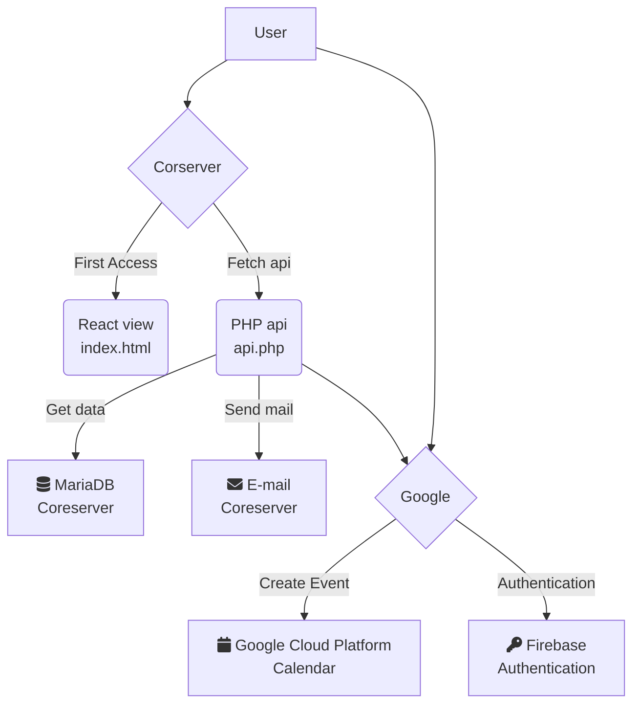

# event.fpv.jp
FPV Japan's integrated Document 

https://nubra-ui-react.netlify.app/introduction

```mermaid
flowchart TD
U[User] --> C{Corserver}
 C -->|First Access| R(React view\nindex.html)
 C -->|Fetch api| P(PHP api\napi.php)
  P -->|Get data| M[fa:fa-database MariaDB\nCoreserver]
  P -->|Send mail| E[fa:fa-envelope E-mail\nCoreserver]
  P --> G{Google}
   G -->|Create Event| D[fa:fa-calendar Google Cloud Platform\nCalendar]
U[User] --> G 
   G -->|Authentication| F[fa:fa-key Firebase\nAuthentication]
```

https://event.fpv.jp/api/user/list?limit=20

http://localhost/api/user/list?limit=20
